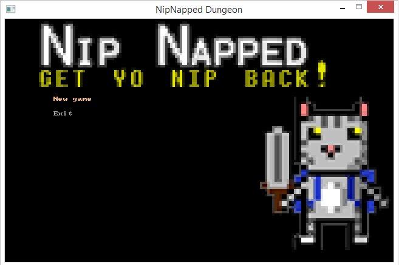
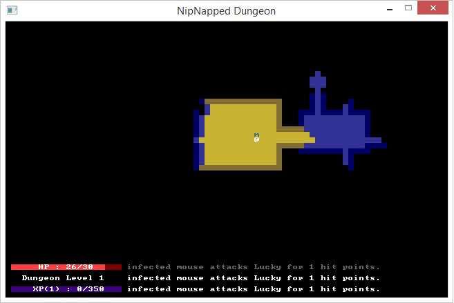
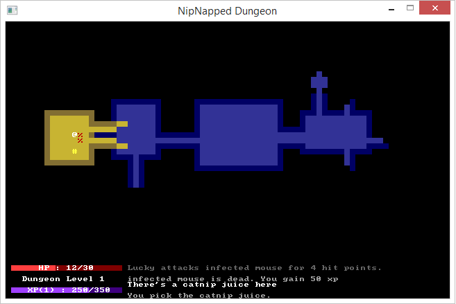

# Nip Napped Dungeon

> [!WARNING]
> Archived and no longer maintained; kept for reference. Written in January 2015 against libtcod 1.6.0. The repo bundles prebuilt Windows (MinGW) libraries and DLLs, so building anywhere else means finding a matching libtcod yourself.

- [Nip Napped Dungeon](#nip-napped-dungeon)
  - [Overview](#overview)
  - [Using it](#using-it)
    - [Building](#building)
    - [Game controls](#game-controls)
  - [Some gameplay](#some-gameplay)

## Overview

A roguelike in C++ that I wrote on my own time in January 2015, following this [C++ roguelike tutorial](https://web.archive.org/web/20160203180745/http://codeumbra.eu/complete-roguelike-tutorial-using-c-and-libtcod-part-1-setting-up) (archived link; the original site is gone).

Nip Napped is one of the first full-fledged games that I created, and it is one of the largest projects I've developed on in C++. Heavily guided by a tutorial and a roguelike C++ library, I created a roguelike game about my childhood cat, Lucky. In short, the game is about how Lucky's catnip was stolen by Kitty The Gray and she has to descend into the dungeon in order to conquer Kitty The Gray and retrieve it. Although the majority of the game framework is from the tutorial that I followed, I added a few of my own parts to the game which includes:

- Stackable items
- Items have a color associated with them in their inventory
- A table-driven monster spawning system that changes depending on what level type you're on
- Level types
- A "final" boss, Kitty The Gray (levels go on forever and ever and repeat level types)
- Monsters "level up" and become more difficult every time you defeat Kitty The Gray (this is also somewhat table-driven)
- The menu photo (but not the little sprite)
- Wherever possible, I avoided magic numbers. In order to do so, I included a "gaming constants" header/source file (needed a source file since they were externs and not all of them were truly constants)

It uses the library [libtcod](https://github.com/libtcod/libtcod), which is a great library that helps game programmers write a roguelike game.

**Tech:** C++, libtcod 1.6.0, SDL2, MinGW g++, make, NetBeans

## Using it

### Building

The `makefile` builds everything in `src/`. On Windows with MinGW, it links against the libtcod libraries in `lib/`, and the DLLs it needs are in the repo root:

```bash
make release   # or: make debug
```

On Linux it expects `libtcod_debug` and `libtcodxx_debug` in the repo root, which aren't included.

### Game controls

- [arrows] to move up, left, right, and down
- [g] to pick up an item
- [i] to access your inventory (to use an item)
- [d] to access your inventory (to drop an item)
- [a-z] to use/drop an item in your inventory
- [esc] to go to the menu

## Some gameplay






